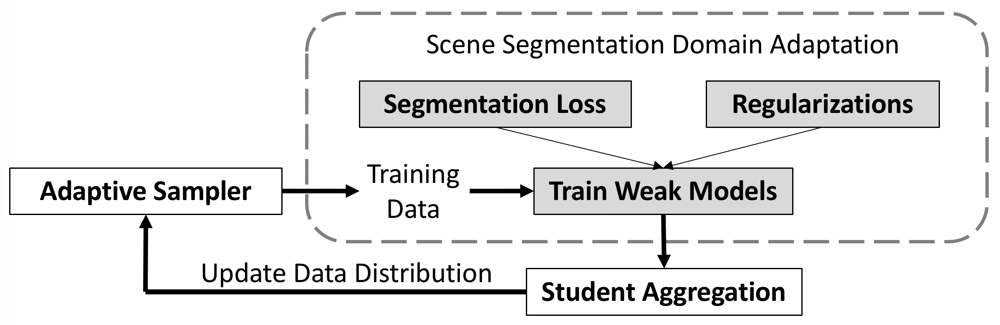

## AdaBoost_Seg


[](https://opensource.org/licenses/MIT)


In this repo, we provide the code for the paper [Adaptive Boosting for Domain Adaptation: Towards Robust Predictions in Scene Segmentation](https://arxiv.org/abs/2103.15685).

[[Paper]](https://zdzheng.xyz/files/TIP_Adaboost.pdf) [[中文解读]](https://zhuanlan.zhihu.com/p/593571554)

## Initial Model
The original DeepLab link of ucmerced is failed. Please use the following link.

[Google Drive] https://drive.google.com/file/d/1BMTTMCNkV98pjZh_rU0Pp47zeVqF3MEc/view?usp=share_link 

[One Drive] https://1drv.ms/u/s!Avx-MJllNj5b3SqR7yurCxTgIUOK?e=A1dq3m

or use 
```
pip install gdown
pip install --upgrade gdown
gdown 1BMTTMCNkV98pjZh_rU0Pp47zeVqF3MEc
```

## News 
- Will more “hard” samples to have a negative effect? How to simulate? (https://github.com/layumi/AdaBoost_Seg/blob/master/Toy_Example.md)
- Evaluation on semi-supervised Cifar10 (https://github.com/layumi/Cifar10-Adaboost)  
- A brief illustration of AdaBoost in English at [[Here]](https://cmp.felk.cvut.cz/~sochmj1/adaboost_talk.pdf) and in Chinese [[中文介绍]](https://zhuanlan.zhihu.com/p/368077560)

## Tips
1. When adopting this method to other fields, we suggest to tune the sampling weight with temperature to suit your task and dataset. In this paper, we do not change it, and keep it as 1. 

2. In our recent experiment, we can achieve a better performance 49.72% (MRNet+Ours) than the number reported in the paper. We think that when Aggrregated Model converges, the adboost sampler updates slowly, which also compromises the performance. If we give more weights to recent snapshots for updating sampler, it works better. 

```bash
python train_ms.py --snapshot-dir ./snapshots/ReRUN_Adaboost_SWA_SE_GN_batchsize2_1024x512_pp_ms_me0_classbalance7_kl0.1_lr2_drop0.1_seg0.5_swa0_recent  --drop 0.1 --warm-up 5000 --batch-size 2 --learning-rate 2e-4 --crop-size 1024,512 --lambda-seg 0.5  --lambda-adv-target1 0.0002 --lambda-adv-target2 0.001   --lambda-me-target 0  --lambda-kl-target 0.1  --norm-style gn  --class-balance  --only-hard-label 80  --max-value 7  --gpu-ids 0  --often-balance  --use-se  --swa  --swa_start 0 --adaboost --recent
```   

## Table of contents
* [Prerequisites](#prerequisites)
* [Prepare Data](#prepare-data)
* [Training](#training)
* [Testing](#testing)
* [Trained Model](#trained-model)
* [The Key Code](#the-key-code)
* [Related Works](#related-works)
* [Citation](#citation)

### Prerequisites
- Python 3.6
- GPU Memory >= 14G (e.g.,RTX6000 or V100) 
- Pytorch 


### Prepare Data
Download [GTA5] and [Cityscapes] to run the basic code.
Alternatively, you could download extra two datasets from [SYNTHIA] and [OxfordRobotCar].

- Download [The GTA5 Dataset]( https://download.visinf.tu-darmstadt.de/data/from_games/ )

- Download [The SYNTHIA Dataset]( http://synthia-dataset.net/download/808/)  SYNTHIA-RAND-CITYSCAPES (CVPR16)

- Download [The Cityscapes Dataset]( https://www.cityscapes-dataset.com/ )

- Download [The Oxford RobotCar Dataset]( http://www.nec-labs.com/~mas/adapt-seg/adapt-seg.html )

 The data folder is structured as follows:
 ```
 ├── data/
 │   ├── Cityscapes/  
 |   |   ├── data/
 |   |       ├── gtFine/
 |   |       ├── leftImg8bit/
 │   ├── GTA5/
 |   |   ├── images/
 |   |   ├── labels/
 |   |   ├── ...
 │   ├── synthia/ 
 |   |   ├── RGB/
 |   |   ├── GT/
 |   |   ├── Depth/
 |   |   ├── ...
 │   └── Oxford_Robot_ICCV19
 |   |   ├── train/
 |   |   ├── ...
 ```

### Training 

- **GTA5 to Cityscapes** (ResNet-101)

Stage-I: (around 49.0%)
```bash
python train_ms.py --snapshot-dir ./snapshots/ReRUN_Adaboost_SWA_SE_GN_batchsize2_1024x512_pp_ms_me0_classbalance7_kl0.1_lr2_drop0.1_seg0.5_swa0  --drop 0.1 --warm-up 5000 --batch-size 2 --learning-rate 2e-4 --crop-size 1024,512 --lambda-seg 0.5  --lambda-adv-target1 0.0002 --lambda-adv-target2 0.001   --lambda-me-target 0  --lambda-kl-target 0.1  --norm-style gn  --class-balance  --only-hard-label 80  --max-value 7  --gpu-ids 0  --often-balance  --use-se  --swa  --swa_start 0 --adaboost
 ```

 Generate Pseudo Label:
 ```bash
python generate_plabel_cityscapes.py --restore ./snapshots/ReRUN_Adaboost_SWA_SE_GN_batchsize2_1024x512_pp_ms_me0_classbalance7_kl0.1_lr2_drop0.1_seg0.5_swa0/GTA5_40000_average.pth
 ```

 Stage-II (with recitfying pseudo label): (around 50.9%)
 ```bash
python train_ft.py --snapshot-dir ./snapshots/Adaboost_1280x640_restore_ft48_GN_batchsize2_960x480_pp_ms_me0_classbalance7_kl0_lr4_drop0.2_seg0.5_BN_80_255_0.8_Noaug_swa2.5W_t97 --restore-from ./snapshots/ReRUN_Adaboost_SWA_SE_GN_batchsize2_1024x512_pp_ms_me0_classbalance7_kl0.1_lr2_drop0.1_seg0.5_swa0/GTA5_40000_average.pth  --drop 0.2 --warm-up 5000 --batch-size 2 --learning-rate 4e-4 --crop-size 960,480 --lambda-seg 0.5 --lambda-adv-target1 0 --lambda-adv-target2 0 --lambda-me-target 0 --lambda-kl-target 0 --norm-style gn --class-balance --only-hard-label 80 --max-value 7 --gpu-ids 0 --often-balance --use-se --input-size 1280,640 --train_bn --autoaug False --swa --adaboost --swa_start 25000 --threshold 97
 ```
 
- **SYNTHIA to Cityscapes**

Stage-I: 
```bash 
python train_ms_synthia.py --snapshot-dir ./snapshots/AdaBoost_SWA_SY_SE_GN_batchsize2_1024x512_pp_ms_me0_classbalance7_kl0.1_lr2_drop0.1_seg0.5_power0.5  --drop 0.1 --warm-up 5000 --batch-size 2 --learning-rate 2e-4 --crop-size 1024,512 --lambda-seg 0.5  --lambda-adv-target1 0.0002 --lambda-adv-target2 0.001   --lambda-me-target 0  --lambda-kl-target 0.1  --norm-style gn  --class-balance  --only-hard-label 80  --max-value 7  --gpu-ids 0  --often-balance  --use-se --swa --swa_start 0 --adaboost  
```

Generate Pseudo Label:
```bash
python generate_plabel_cityscapes_SYNTHIA.py --restore ./snapshots/AdaBoost_SWA_SY_SE_GN_batchsize2_1024x512_pp_ms_me0_classbalance7_kl0.1_lr2_drop0.1_seg0.5_power0.5/GTA5_50000_average.pth
```
 
Stage-II: 
```bash 
python train_ft_synthia.py --snapshot-dir ./snapshots/Cosine_Adaboost_SY_1280x640_restore_ft_GN_batchsize8_512x256_pp_ms_me0_classbalance7_kl0.1_lr8_drop0.1_seg0.5_BN_255_Noaug_t777_swa2.5W --restore ./snapshots/AdaBoost_SWA_SY_SE_GN_batchsize2_1024x512_pp_ms_me0_classbalance7_kl0.1_lr2_drop0.1_seg0.5_power0.5/GTA5_50000_average.pth --drop 0.1 --warm-up 5000 --batch-size 8 --learning-rate 8e-4 --crop-size 512,256 --lambda-seg 0.5 --lambda-adv-target1 0 --lambda-adv-target2 0 --lambda-me-target 0 --lambda-kl-target 0 --norm-style gn --class-balance --only-hard-label 50 --max-value 7 --gpu-ids 0 --often-balance  --use-se  --input-size 1280,640    --autoaug False   --swa --swa_start 25000 --threshold 777 --adaboost --train_bn  --cosine
```

- **Cityscapes to Oxford RobotCar** 

Stage-I: (around 73.80%) higher than paper.
```bash 
python train_ms_robot.py --snapshot-dir ./snapshots/Adaboost_SWA3W_Robot_SE_GN_batchsize6_adapative_kl0.1_sam_lr6  --drop 0.1 --warm-up 5000 --batch-size 6 --learning-rate 6e-4 --crop-size 800,400 --lambda-seg 0.5  --lambda-adv-target1 0.0002 --lambda-adv-target2 0.001   --lambda-me-target 0  --lambda-kl-target 0.1  --norm-style gn  --class-balance  --only-hard-label 80  --max-value 7  --gpu-ids 0,1,2  --often-balance  --use-se  --swa --swa_start 30000 --adaboost  --sam
```

Generate Pseudo Label:
```bash
python generate_plabel_robot.py --restore ./snapshots/Adaboost_SWA3W_Robot_SE_GN_batchsize6_adapative_kl0.1_sam_lr6/GTA5_70000_average.pth
```
 
Stage-II: (around 75.62%) 
```bash 
python train_ft_robot.py --snapshot-dir ./snapshots/Adaboost_0.9RB_b3_lr3_800x432_97_swa0W_T80 --restore-from  ./snapshots/Adaboost_SWA3W_Robot_SE_GN_batchsize6_adapative_kl0.1_sam_lr6/GTA5_70000_average.pth   --drop 0.1 --warm-up 5000 --batch-size 3 --learning-rate 3e-4 --crop-size 800,432 --lambda-seg 0.5 --lambda-adv-target1 0 --lambda-adv-target2 0 --lambda-me-target 0 --lambda-kl-target 0 --norm-style gn --class-balance --only-hard-label 50 --max-value 7 --gpu-ids 0,1,2 --often-balance  --use-se  --input-size 1280,960  --train_bn --adaboost --swa --swa_start 0  --threshold 0.8 --autoaug False
```

### Ablation Studies

- GTA5 to Cityscapes (VGG-16)

Stage-I: (around 39.5%)
```bash
python train_ms.py --snapshot-dir ./snapshots/255VGGBN_Adaboost_SWA_SE_GN_batchsize3_1024x512_pp_ms_me0_classbalance7_kl0.1_lr3_drop0.1_seg0.5_swa0_auto  --drop 0.1 --warm-up 5000 --batch-size 3 --learning-rate 3e-4 --crop-size 1024,512 --lambda-seg 0.5  --lambda-adv-target1 0.0002 --lambda-adv-target2 0.001   --lambda-me-target 0  --lambda-kl-target 0.1  --norm-style gn  --class-balance  --only-hard-label 80  --max-value 7  --gpu-ids 0,1,2  --often-balance  --use-se  --swa  --swa_start 0 --adaboost  --model DeepVGG --autoaug 
```
 
  ### Testing
 ```bash
 python evaluate_cityscapes.py --restore-from ./snapshots/ReRUN_Adaboost_SWA_SE_GN_batchsize2_1024x512_pp_ms_me0_classbalance7_kl0.1_lr2_drop0.1_seg0.5_swa0/GTA5_40000_average.pth
 ```
 
 ### Trained Model
 The trained model is available at [Wait]

 - The folder with `SY` in name is for SYNTHIA-to-Cityscapes
 - The folder with `RB` in name is for Cityscapes-to-Robot Car
 
 ### The Key Code
 Core code is relatively simple, and could be directly applied to other works. 
 
 Adaptive Data Sampler: https://github.com/layumi/AdaBoost_Seg/blob/master/train_ms.py#L429-L436 
 
 Student Aggregation: https://github.com/layumi/AdaBoost_Seg/blob/master/train_ms.py#L415-L427 
 
 
 ### Related Works
 We also would like to thank great works as follows:
 - https://github.com/layumi/Seg-Uncertainty 
 - https://github.com/wasidennis/AdaptSegNet
 - https://github.com/RoyalVane/CLAN
 - https://github.com/yzou2/CRST

 ### Citation
 ```bibtex
@article{zheng2021adaboost,
   title={Adaptive Boosting for Domain Adaptation: Towards Robust Predictions in Scene Segmentation},
   author={Zheng, Zhedong and Yang, Yi},
   journal={IEEE Transactions on Image Processing},
   doi={10.1109/TIP.2022.3195642},
   note={\mbox{doi}:\url{10.1109/TIP.2022.3195642}},
   year={2021}
 }
 ```
